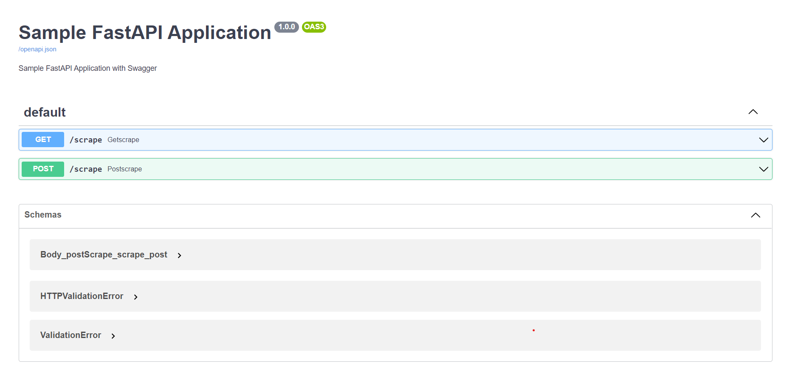

## FastAPI using [FastAPI](https://fastapi.tiangolo.com/) and [Uvicorn](https://www.uvicorn.org/#introduction)

### FastAPI

FastAPI is a modern, fast (high-performance), web framework for building APIs with Python 3.9+ based on standard Python type hints.

### Uvicorn

Uvicorn is a lightning-fast ASGI server implementation.

## Setting up the VirtualEnv and install dependencies

Dependencies will be installed from the requirements. Python version 3.9.2 is used for this project.

| Library | Version |
| ------ | ------ |
| [aiohttp](https://pypi.org/project/aiohttp/)                  | 3.8.1  |
| [uvicorn](https://pypi.org/project/uvicorn/)                  | 0.17.6  |
| [fastapi](https://pypi.org/project/fastapi/)                  | 0.78.0  |
| [asyncio](https://pypi.org/project/asyncio/)                  | 3.4.3  |

## Run the Application

py fastAPI.py

This will start the application on port 8000

## Test the application

FastAPI also automatically generated fully interactive API documentation that we can use to interact with our API. 
We can visit http://127.0.0.1:8000/docs in our browser to see the interactive API documentation provided by [Swagger UI](https://github.com/swagger-api/swagger-ui):

The server will start at <http://localhost:8000/docs>.

